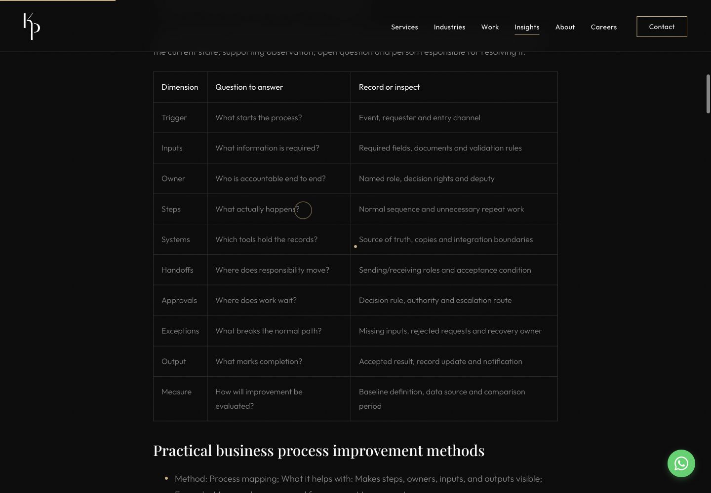

# Step 11C — Strengthen Two Existing Authority Assets

## Step 11C Status

**PASS — deployed and production verified.** Scope: only the body content of the Process Improvement and ERP Selection Insights. No new pages, outreach, Printcubator contact or Step 11D work.

Clean isolated checkout reused at main `533d3e561966a0e96f73cde3773199bf8c18fb59`. The original stale, dirty checkout remains untouched. No redirect, schema, component, CSS or service source changes were needed.

## Process Improvement Before

The page already explained improvement before automation, seven practical methods, warning signs, brief examples and FAQs. It lacked a reusable diagnostic worksheet, a mapped example, prioritization criteria and defined measures. Rendered body: 965 words, 14 section/question headings, no tables, three contextual internal links. These are descriptive observations, not word-count targets.

Title/H1: **Business Process Improvement Methods for Growing Companies**. SEO title: **Business Process Improvement Methods for Growing Teams**. Description: **Learn practical business process improvement methods for reducing manual work, improving visibility, simplifying workflows, and preparing for automation.** The introduction defined improvement as analysing current work, simplifying unnecessary steps and finding delays/errors. [Complete before audit, including headings, checklist items, links and schema](step-11c-evidence/article-before-audit.json).

## Process Improvement After

The concise opening definition now explicitly covers delays, duplication, handoffs and ownership before tool selection. Existing practical methods, improvement-versus-automation guidance, service relationships and FAQs remain. Added a diagnosis worksheet, specific improvement actions, an illustrative request flow, a five-way implementation decision, prioritization worksheet and measurement definitions. Rendered body: 1,817 words, five semantic tables and 30 list items. [Readable content](step-11c-evidence/business-process-improvement-methods-proposed.md).

## Process Audit Framework

Ten dimensions: **Trigger → Inputs → Owner → Steps → Systems → Handoffs → Approvals → Exceptions → Output → Measure**. Each supplies a question and evidence to record. Readers trace a normal case and an exception with the people doing the work, then validate findings with the accountable owner. The worksheet is described as editorial guidance, not proprietary research or a numerical scoring model.

## Process Checklist

Twelve reusable questions cover intake, accountable ownership, standardized inputs, duplicate entry, unnecessary steps, waiting, approvals, exceptions, source of truth, status visibility, baseline measurement and deterministic automation candidates. Readers record evidence, owner and next action. No gate or downloadable page was added.

## Illustrative Workflow

**Illustrative example only; not a KP Infotech client project or delivered result.** Purchase request submitted → validation → manager approval → finance/procurement review → approved/rejected → system update → requester notification. Incomplete requests return for correction. A table identifies delay points, repeated entry, unclear review ownership and exceptions, with possible improvements. No outcome figures are asserted.

The prioritization table labels its rows illustrative and leaves a reusable reader row. Frequency, effort, rework, waiting and rule clarity inform an agreed next action; no invented score or universal weighting. Measurement guidance defines cycle/waiting time, manual touches, rework denominator, approval delay, exceptions, report effort and handoffs, using comparable baseline periods without savings promises.

## ERP Selection Before

The page already started with operational requirements, listed business modules and fit criteria, covered cost categories, included a short checklist and linked to the Odoo guide and two service owners. It lacked a reusable evidence matrix and sufficiently specific demo, migration, UAT and partner-evaluation questions. Rendered body: 859 words, 14 section/question headings, no tables and three contextual links.

Title/H1: **How to Choose an ERP System: Requirements, Costs, and Evaluation Checklist**. SEO title: **How to Choose an ERP System: Evaluation Checklist**. Description: **Learn how to choose an ERP system by mapping requirements, modules, integrations, costs, deployment options, vendor fit, and implementation readiness.** [Full before audit](step-11c-evidence/article-before-audit.json).

## ERP Selection After

The useful introduction, operational problem examples, fit criteria, concise cost categories, service links and FAQs remain. Added requirements sequence, business-area checklist, simple prioritization, evaluation matrix, scenario-based demo checklist, partner/migration questions, customization decisions, red flags and final sign-off checklist. Odoo is evaluated alongside alternatives without ranking or partnership claims. Rendered body: 1,975 words, two semantic tables and 77 list items. [Readable content](step-11c-evidence/how-to-choose-erp-system-proposed.md).

## ERP Requirements Framework

Sequence: map processes; identify system-of-record needs; define essential capabilities; document integrations; define users/roles; identify reporting needs; define migration; record operational/security constraints; evaluate implementation dependencies; then compare options.

The reusable requirements table covers Sales/CRM, Purchasing, Inventory, Finance, Manufacturing where relevant, HR/payroll where relevant, Users/access, Reporting and Integration. Each row pairs requirements with evidence to request. Not every business needs every capability. Priority categories are MUST HAVE, SHOULD HAVE, COULD HAVE and NOT REQUIRED NOW, with acceptance conditions and owners; no proprietary-method claim.

## Evaluation Matrix

Columns: **Requirement | Priority | Standard Support | Configuration Needed | Customization Needed | Integration Needed | Vendor Evidence | Implementation Risk | Owner**. The illustrative purchase-approval row explicitly marks support unverified. A reader row provides fill-in prompts. No vendor scores or tested-capability claims. Readers record versions, assumptions, limitations and requirement-owner acceptance.

## Demo / Implementation Checklist

Demo guidance asks for real buyer scenarios, inventory movements, approvals, reports, permissions, exceptions, integration failure handling, migration and custom-code boundaries. Demo success is distinguished from later UAT of the configured solution and migrated data. Partner questions cover discovery, configuration discipline, migration/integration ownership, UAT, training, cutover and support. Migration questions address scope, history, cleanup, duplicates, archive choices and reconciliation. A final ten-item checklist records readiness and unresolved conditions before signing.

## Metadata

Both URLs, canonicals, titles, SEO titles/descriptions, excerpts, images, categories, tags and existing reading-time fields are unchanged. No metadata defect required a change. No new schema type, page, download or sitemap URL was added. Existing BlogPosting publisher, author, mainEntityOfPage, headline, image and datePublished remain intact. [Build quality/preservation result](step-11c-evidence/quality-build.json).

## Authors / Dates

Both articles retain their existing Organization author fallback with no invented person/reviewer or credentials. Published dates remain **2025-11-26T06:32:00.000Z** and **2025-12-12T06:32:00.000Z**. No visible updated/reviewed date is added and no date provenance claim is made.

The CMS mutation automatically changes `_rev` and `_updatedAt`. Existing article code uses `_updatedAt` for BlogPosting `dateModified`, so that machine-readable technical modification timestamp changes for these two articles only. The audit checks it against the exact post-mutation CMS value; all other schema fields must match baseline. This is not an expert-review claim or a change to publication-date policy. [Before snapshot](step-11c-evidence/cms-before.json), [after snapshot](step-11c-evidence/cms-after.json), [revision-guarded transaction](step-11c-evidence/mutation.json).

## Internal Links

All prior contextual links are preserved. Process Improvement adds one contextual link to the existing Automation Tools guide (already a related article). ERP Selection adds links to the existing ERP cost and deployment-comparison guides, while retaining the Odoo guide and ERP/Business Automation service links. No repetitive anchor additions. Commercial implementation ownership is unchanged.

Step 4 graph passes. Zero current-site links point at the three historical roots. All three Step 11B root redirects and blog equivalents remain direct 301s; excluded redirects and four linked 404s remain unchanged. Local checks cover 73 unique internal resources/links across the three reclaimed destinations, all direct 200s.

## Authority Value

Process Improvement can be referenced for a concrete audit structure, workflow diagnosis and measurement definitions. ERP Selection can be referenced for a reusable requirements/evidence matrix and questions buyers can use in demonstrations and implementation reviews. The value is practical decision support, not length, invented research or claims of acquired links.

The before articles contain no external source citations or numerical research claims. No academic method names, benchmark statistics or certification claims were introduced. Product-specific technical cross-checks used official [Odoo upgrade documentation](https://www.odoo.com/documentation/18.0/administration/upgrade.html) for custom-module maintenance and [Microsoft implementation testing guidance](https://learn.microsoft.com/en-us/dynamics365/guidance/implementation-guide/testing-strategy) for test planning. These support the narrow maintenance/testing cautions; the worksheets are editorial synthesis, not vendor rankings or proprietary research. No decorative citations were added to the articles.

June 2026 observations remain dated: Process Improvement 7 backlinks / 6 referring domains; ERP Selection 2 / 2. Current referring links were not revalidated. No earned-backlink or ranking claim.

## Tests

Authenticated production build PASS; built-in proof governance PASS on all 56 pages. **145 tests passed, 0 failed, 0 skipped, 0 cancelled**, including **10 Step 11C tests** and all 12 Step 11B tests. [Full test log](step-11c-evidence/tests.txt).

CMS preservation: 349 records compared; exactly two changed only `content`, `_rev` and `_updatedAt`; 347 unchanged. [CMS comparison](step-11c-evidence/cms-preservation.json). All 54 other rendered pages match baseline facts. Both targeted pages preserve metadata, authors, publication dates and schema except the expected technical dateModified. No source-file changes to redirects, components, schemas or other pages. Credential scan: zero matches across 837 build/evidence files. Deploy dry-run and `git diff --check` PASS.

## Regression

Steps 1C/1G, 2, 3, 4, 7A–7E, 9B/9C, 10B and 11B PASS. Local Step 1G: 56 pages, 32 redirect checks, 63 removed-project checks, zero dead or legacy links; marketing sample remains 404. Step 3 has an explicit semantic-error gate. Step 5/6/8 content and ownership safeguards remain covered by full-suite and baseline preservation checks. [Regression exits](step-11c-evidence/build-regression-exits.json), [HTTP checks](step-11c-evidence/local.json), [Step 1G](step-11c-evidence/step1g-local.json).

Browser verification at **1440×1000 desktop** and **390×844 mobile** passes for both local articles. Seven semantic tables render with headers and contained horizontal scrolling; no document overflow. ERP matrix horizontal scroll was exercised to reach later columns. The existing table component and focus region are reused. No UI/CSS/schema edits or Studio deployment are needed. [Layout measurements](step-11c-evidence/layout-local.json). The preferred browser plugin failed on its native dependency; available browser-control fallback completed verification.

## Deployment

Release commit: `ef27818e9bf18b0ac229b61767a259801f8062d3`, normally pushed to `main`. Worker `website` deployed in the existing KP Infotech Cloudflare account. Deployment ID: `0730ee07-2fcb-4087-9312-63dc98d4e2c0`. Version: `9d4565c2-b333-4f70-b781-ddb6121c0290`, active at 100%. Timestamp: **2026-09-30 06:42:31.401 UTC / 12:12:31.401 IST**.

[Deployment log](step-11c-evidence/deploy.txt), [verified deployment history](step-11c-evidence/deployments-verified.json). No Studio deployment. A follow-up documentation commit records the completed production checks and screenshots; it changes no article or runtime source.

## Production Verification

**PASS.** Both live articles return 200, are indexable/self-canonical and have one H1. Visible content, seven semantic tables, reusable lists, author fallback, unchanged publication dates and the expected technical dateModified all pass. All prior contextual links remain; the three useful new links resolve to canonical destinations. [Article quality and preservation](step-11c-evidence/quality-production.json).

All 56 sitemap pages pass, including the five service pages, five Technical Overviews and homepage. Robots passes; sample marketing and all four preserved linked 404s remain 404. All three reclaimed roots and blog equivalents are one-hop 301s to their corresponding 200 Insights. All 73 checked internal links/resources are direct 200s. No internal links to historical roots. [HTTP evidence](step-11c-evidence/production.json), [Step 1G](step-11c-evidence/step1g-production.json).

Production Steps 1C/1G, 2, 3, 4, 7A–7E, 9B/9C and 10B pass. Step 3 verifies 353 images with zero missing-alt, H1, hierarchy, duplicate-ID or empty-control issues. Step 10B preserves the 21 article author assignments (3 Krupa, 12 Poojan, 6 Organization fallbacks). All 54 other pages retain their baseline content, metadata, schema and links. [Production regression exits](step-11c-evidence/production-regression-exits.json).

Live browser checks at 1440×1000 and 390×844 show no page-wide overflow. Tables scroll within their existing accessible regions; the ERP matrix was scrolled to reach its later columns. [Layout measurements](step-11c-evidence/layout-production.json).

[Process mobile screenshot](step-11c-evidence/step11c-process-mobile.png), [ERP desktop screenshot](step-11c-evidence/step11c-erp-desktop.png), [ERP mobile screenshot](step-11c-evidence/step11c-erp-mobile.png).

## Remaining Step 11 Queue

- On-premise vs cloud ERP review.
- DevOps authority asset review.
- C-class repairs.
- Printcubator reclamation, retained as a separately authorized manual lead.
- Fresh referring-page export.
- Ecosystem contribution.

No queue item was implemented. No outreach, Printcubator contact, new article, Search Console submission or Step 11D work occurred.
